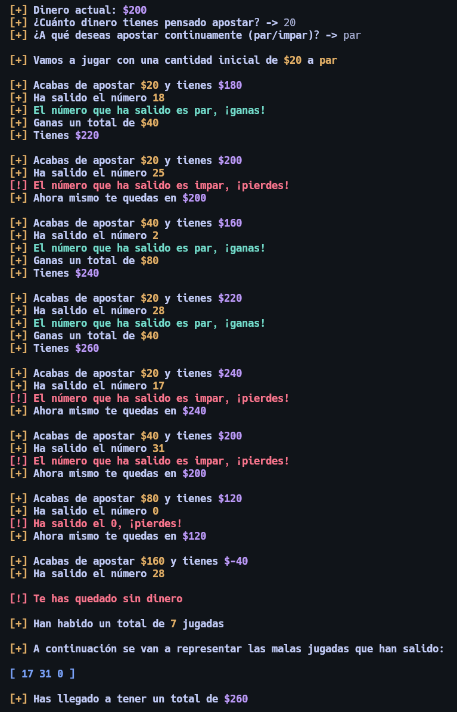
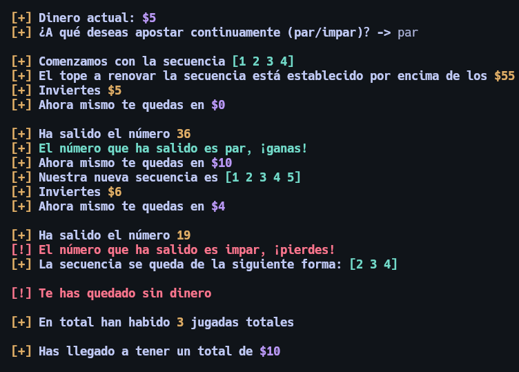

# Ruleta - Martingala & Inverse Labrouchere

Este proyecto es una herramienta escrita completamente en Bash que simula dos de las estrategias más conocidas dentro del mundo de la ruleta:

- Martingala
- Inverse Labrouchere

El objetivo de esta herramienta es demostrar de forma práctica cómo, incluso aplicando técnicas consideradas "efectivas", el jugador termina perdiendo dinero. La simulación representa cómo el azar y la progresión de apuestas llevan de forma inevitable a la pérdida total del capital inicial.

Ha sido una oportunidad para aprender Bash a través de un caso real, reforzando conceptos como:

- Manejo de argumentos y opciones
- Validaciones
- Arrays
- Estructuras de control (condicionales y bucles)
- Colores y control del cursor en terminal
- Diseño de scripts interactivos

---

## Características

- Simulación automática de apuestas con ciclos de juego
- Visualización en tiempo real del dinero actual, resultados y evolución
- Aplicación fiel de las reglas de Martingala e Inverse Labrouchere
- Panel de ayuda integrado con soporte para colores en terminal
- Control de errores y validaciones robustas
- Interfaz interactiva por línea de comandos

---

## Técnicas Simuladas

### Martingala

Consiste en duplicar la apuesta cada vez que se pierde, apostando siempre a par o impar. Cuando se gana, se recupera lo perdido más una unidad de ganancia, y se vuelve a la apuesta inicial.



### Inverse Labrouchere

Se basa en una secuencia de números que se va modificando según el resultado. Al ganar, se agrega la apuesta al final de la secuencia. Al perder, se eliminan los extremos. Si la secuencia desaparece o se rompe, se reinicia.

Ambas estrategias se muestran en tiempo real, y el script simula la pérdida progresiva hasta quedar sin dinero.



---

## Uso

```bash
./ruleta.sh -m <dinero_inicial> -t <tecnica>
./ruleta.sh -m 1000 -t martingala
./ruleta.sh -m 500 -t inverseLabrouchere

### Requisitos

- GNU/Linux con `bash`
- Terminal compatible con secuencias ANSI (colores)

### Ejecución

git clone https://github.com/Gabriel-GR14/ruleta.git
chmod +x ruleta.sh
./ruleta.sh
